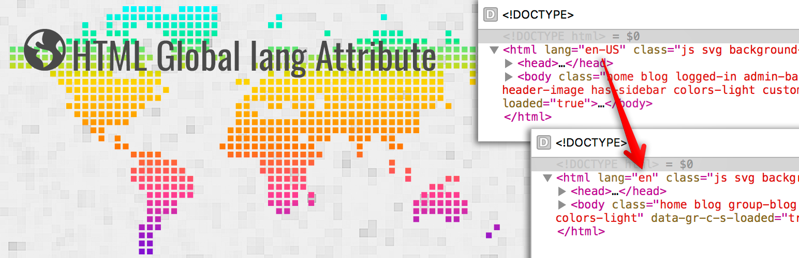

# wp-html-global-lang-attribute

The lang attribute specifies the language of the element's content.
Common examples are "en" for English, "es" for Spanish, "fr" for French, and so on.
This plugin slice the language attribute for HTML tag, For example: lang="en-US" to lang="en"

## Helpful information
[Plugin Handbook](https://developer.wordpress.org/plugins/wordpress-org/how-to-use-subversion/)

# LICENSE

